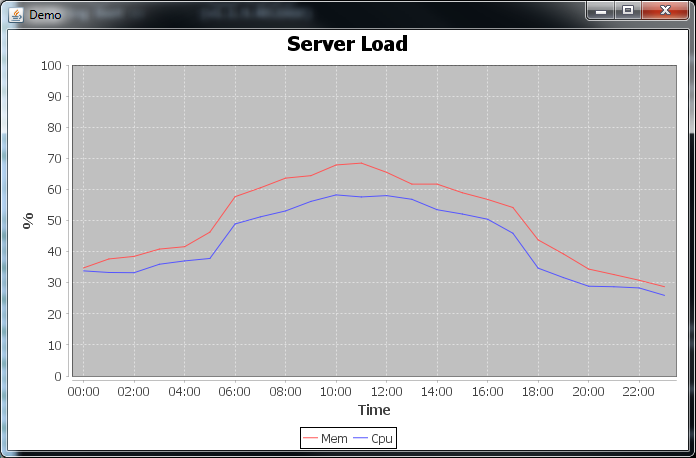

# Server monitoring using MongoDB as backend

This project is part of my Bachelor's Degree work:

*"Comparative Analysis of NoSQL Databases and Applications"*  
Università degli Studi di Milano-Bicocca

Relator: Andrea Maurino  
Co-relator: Blerina Spahiu

# Tutorial

## Prerequisites

- Java 1.7 or newer
- MongoDB 2.2 or newer

## Build from source

### Download code

You can either:

- **download** directly a tar/zip of *master* branch from GitHub repository:  
https://github.com/megadix/server_monitoring_mongodb/archive/master.zip
- **clone the repository**:  
git@github.com:megadix/server_monitoring_mongodb.git

### Configure

Open:  
*src/main/resources/application.properties*

and edit the entries to match your MongoDB installation:

    spring.data.mongodb.host=localhost
    spring.data.mongodb.port=27017
    spring.data.mongodb.database=monitoring
    
    monitoring.collectionName=monitoringData

If your instance is password-protected, add:

    spring.data.mongodb.username=[YOUR USERNAME]
    spring.data.mongodb.password=[YOUR PASSWORD]

### Build

Open a command line terminal in the root directory and issue this command:

On Windows:

    gradlew build

On Linux/Unix:

    chmod u+x gradlew
    ./gradlew build

***gradlew*** is the [Gradle Wrapper](http://www.gradle.org/docs/current/userguide/gradle_wrapper.html), a small script and library (under */gradle* sub-directory) that provides  the Gradle build system, so you don't have to install it on your machine.

    >gradlew build

    :compileJava
    :processResources
    :classes
    :jar
    :bootRepackage
    :assemble
    :compileTestJava
    :processTestResources UP-TO-DATE
    :testClasses
    :test
    :check
    :build

    BUILD SUCCESSFUL

    Total time: 20.612 secs

The build process creates a /build sub-directory, with all the artefacts.

## Setup test data

To create test data you must run the application in SETUP mode:

    java -jar build\libs\megadix-monitoring-mongodb-1.0.0.jar SETUP

The output will be similar to this (cut for brevity):

      .   ____          _            __ _ _
     /\\ / ___'_ __ _ _(_)_ __  __ _ \ \ \ \
    ( ( )\___ | '_ | '_| | '_ \/ _` | \ \ \ \
     \\/  ___)| |_)| | | | | || (_| |  ) ) ) )
      '  |____| .__|_| |_|_| |_\__, | / / / /
     =========|_|==============|___/=/_/_/_/
     :: Spring Boot ::        (v1.1.5.RELEASE)

    2014-08-29 12:43:47.166  INFO 6576 --- [           main] monitoring.Application                   : Starting Application on dimitri-PC with PID 6576 (G:\progetti\server_monitoring_mongodb\build\libs\megadix-monitoring-mongodb-1.0.0.jar started by dimitri in G:\progetti\server_monitoring_mongodb)
    2014-08-29 12:43:47.507  INFO 6576 --- [           main] s.c.a.AnnotationConfigApplicationContext : Refreshing org.springframework.context.annotation.AnnotationConfigApplicationContext@595f1b15: startup date [Fri Aug 29 12:43:47 CEST 2014]; root of context hierarchy
    2014-08-29 12:43:50.076  INFO 6576 --- [           main] o.s.j.e.a.AnnotationMBeanExporter        : Registering beans for JMX exposure on startup
    2014-08-29 12:43:51.501  INFO 6576 --- [           main] monitoring.Application                   : Server: ATTILA, saved 100 samples
    2014-08-29 12:43:51.623  INFO 6576 --- [           main] monitoring.Application                   : Server: ATTILA, saved 200 samples
    2014-08-29 12:43:51.730  INFO 6576 --- [           main] monitoring.Application                   : Server: ATTILA, saved 300 samples
    2014-08-29 12:43:51.826  INFO 6576 --- [           main] monitoring.Application                   : Server: ATTILA, saved 400 samples
    2014-08-29 12:43:51.915  INFO 6576 --- [           main] monitoring.Application                   : Server: ATTILA, saved 500 samples
    2014-08-29 12:43:52.005  INFO 6576 --- [           main] monitoring.Application                   : Server: ATTILA, saved 600 samples
    2014-08-29 12:43:52.085  INFO 6576 --- [           main] monitoring.Application                   : Server: ATTILA, saved 700 samples
    2014-08-29 12:43:52.192  INFO 6576 --- [           main] monitoring.Application                   : Server: ATTILA, saved 800 samples
	
	[...]
	
    2014-08-29 12:44:15.978  INFO 6576 --- [           main] monitoring.Application                   : Server: DEMOTAPE, saved 9400 samples
    2014-08-29 12:44:16.013  INFO 6576 --- [           main] monitoring.Application                   : Server: DEMOTAPE, saved 9500 samples
    2014-08-29 12:44:16.047  INFO 6576 --- [           main] monitoring.Application                   : Server: DEMOTAPE, saved 9600 samples
    2014-08-29 12:44:16.107  INFO 6576 --- [           main] monitoring.Application                   : Server: DEMOTAPE, saved 9700 samples
    2014-08-29 12:44:16.144  INFO 6576 --- [           main] monitoring.Application                   : Server: DEMOTAPE, saved 9800 samples
    2014-08-29 12:44:16.179  INFO 6576 --- [           main] monitoring.Application                   : Server: DEMOTAPE, saved 9900 samples
    2014-08-29 12:44:16.244  INFO 6576 --- [           main] monitoring.Application                   : Server: DEMOTAPE, saved 10000 samples
    2014-08-29 12:44:16.273  INFO 6576 --- [           main] monitoring.Application                   : Started Application in 29.71 seconds (JVM running for 30.459)
    2014-08-29 12:44:16.275  INFO 6576 --- [       Thread-2] s.c.a.AnnotationConfigApplicationContext : Closing org.springframework.context.annotation.AnnotationConfigApplicationContext@595f1b15: startup date [Fri Aug 29 12:43:47 CEST 2014]; root of context hierarchy
    2014-08-29 12:44:16.276  INFO 6576 --- [       Thread-2] o.s.j.e.a.AnnotationMBeanExporter        : Unregistering JMX-exposed beans on shutdown

### Run example

To view and example data extraction, execute the application in RUN mode:

    java -jar build\libs\megadix-monitoring-mongodb-1.0.0.jar RUN

The application will extract data, process it, and display a window with a chart:

